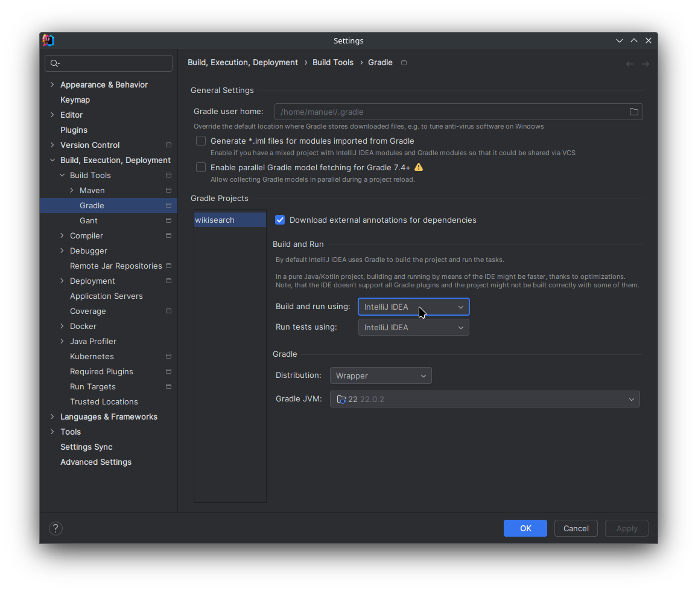
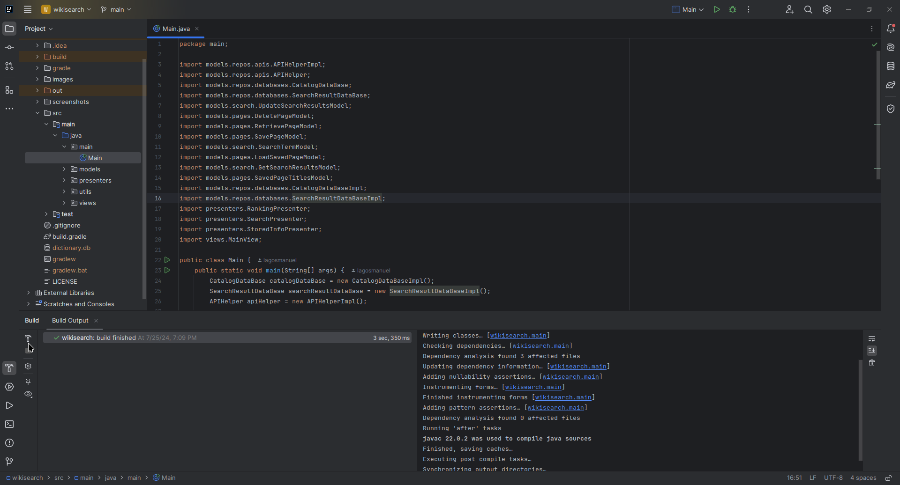
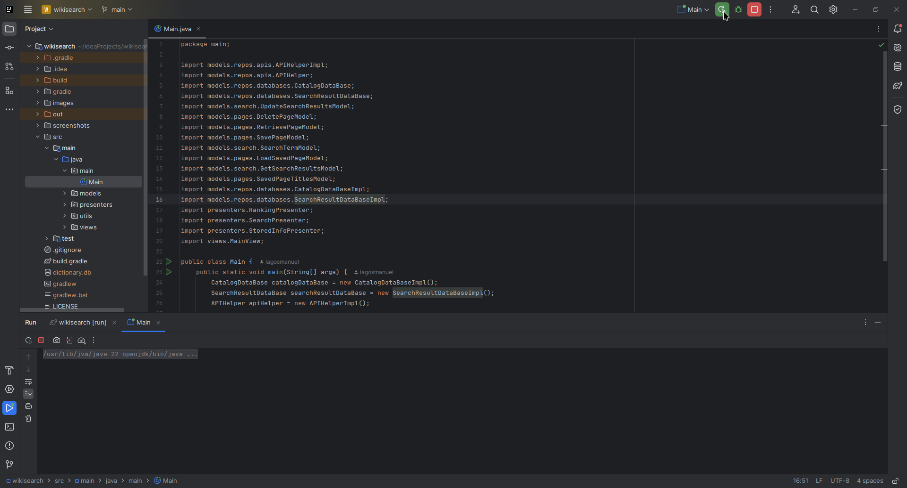
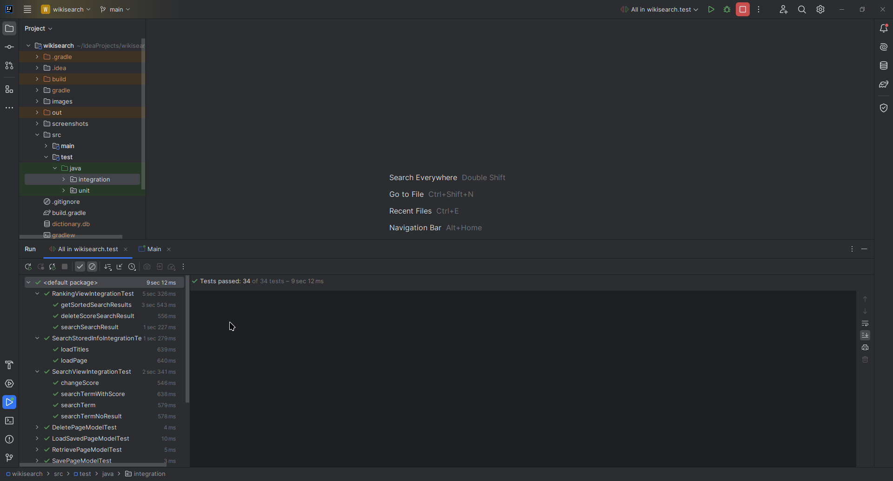
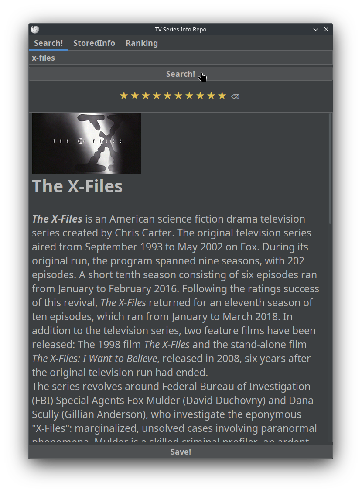
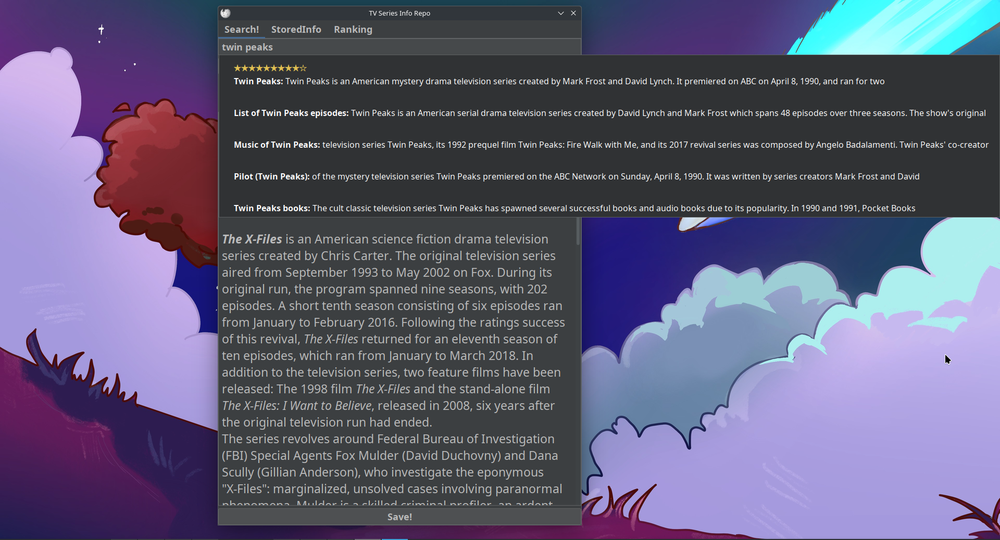
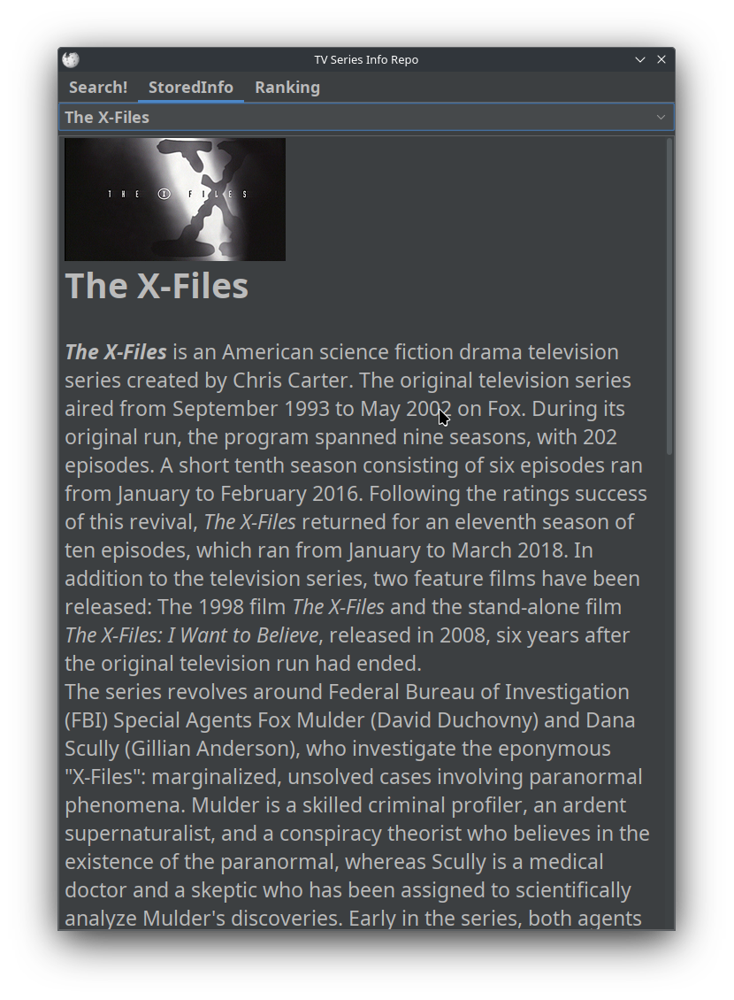
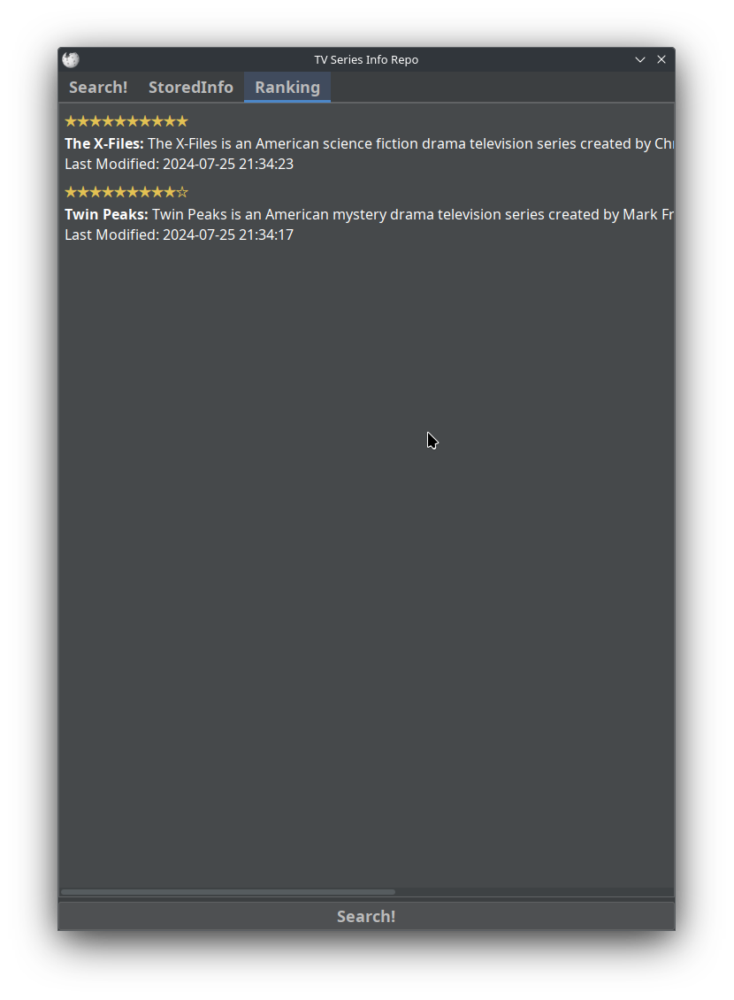

# Wikisearch

## Description

**Wikisearch** is an application designed to search, store, and manage information about television series. Utilizing the Wikipedia API, Wikisearch allows users to search for series information, save it locally, and assign a rating to each series. Additionally, it provides functionalities to view, modify, and delete entries in the local database.

This project was developed as part of the "Software Design and Development" course at the National University of the South.

## Features

### Core Functionality

1. **Series Search**:
   - Allows searching for information about a television series on Wikipedia.
   - Displays the title and introduction of the series.
   - Allows saving the information locally for future reference.

2. **Local Information Management**:
   - View locally stored series.
   - Modify the saved information.
   - Delete entries from the local database.

3. **Assign Ratings**:
   - Users can assign a rating from 1 to 10 to a searched series.
   - Displays and allows modification of the rating if it already exists.
   - Rating is independent of whether the series is saved or not.

4. **Rated Series List**:
   - Displays a list of all rated series, sorted by rating.
   - Allows selecting a series and repeating the search to view its information.

5. **Rating Indicator in Search Results**:
   - Marks series with assigned ratings in search results with a special icon.

### Optional Features

1. **Android Migration** (Optional):
   - The application has been migrated to the Android platform using Java or Kotlin.

2. **Wikipedia Link** (Optional):
   - Includes a link to the original Wikipedia page that opens in the default browser.

3. **Cover Photo** (Optional):
   - Displays the cover image of the searched series, in addition to the textual information.

## Technologies Used

- **Java**: Primary language used for application development.
- **Gradle**: Build automation tool.
- **JUnit**: Tool for unit and integration testing.
- **MVP (Model-View-Presenter)**: Architectural pattern used to structure the code.

## Installation

To run the project, follow these steps:

1. Clone the repository:
   ```bash
   git clone https://github.com/lagosmanuel/Wikisearch.git
   ```

2. Open the project in IntelliJ IDEA.
   - Build and dependency management is handled through Gradle integrated in IntelliJ IDEA.

3. Change in Settings > Build, Execution, Development > Build Tools > Gradle
    - Build and run using: IntelliJ IDEA
    - Run tests using: IntelliJ IDEA



4. Build the project using IntelliJ IDEA:
   - Select "Build" from the menu and then "Build Project".



5. Run the application from IntelliJ IDEA:
   - Select "Run" from the menu and then "Run 'Wikisearch'".



## Testing

To run unit and integration tests:

1. Open the project in IntelliJ IDEA.

2. Run the tests:
   - Select "Run" from the menu and then "Run All Tests" to execute all unit and integration tests.



## Screenshots

Here are some screenshots of **Wikisearch** in action:

1. **Search Screen**:
   _Search for television series on Wikipedia._
   

2. **Search Bar**:
   _Search for television series on Wikipedia._
   

3. **Series Details**:
   _View the details and assign ratings to the series._
   

4. **Rated Series List**:
   _View and manage a list of rated series._
   

## Contributing

Contributions are welcome! You can either fork the repository and submit a pull request with your changes, or simply open an issue if you have any suggestions or feedback.

## License

This project is licensed under the GNU License - see the [LICENSE](LICENSE) file for details.

## Contact

If you have any questions or comments about the project, feel free to contact me via GitHub.
